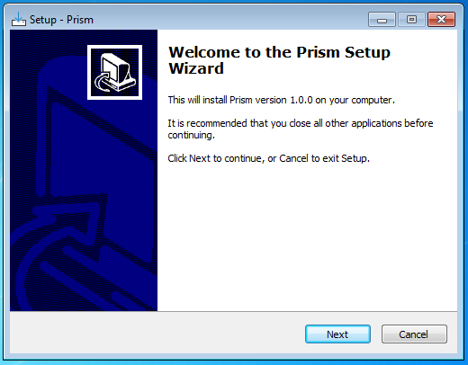
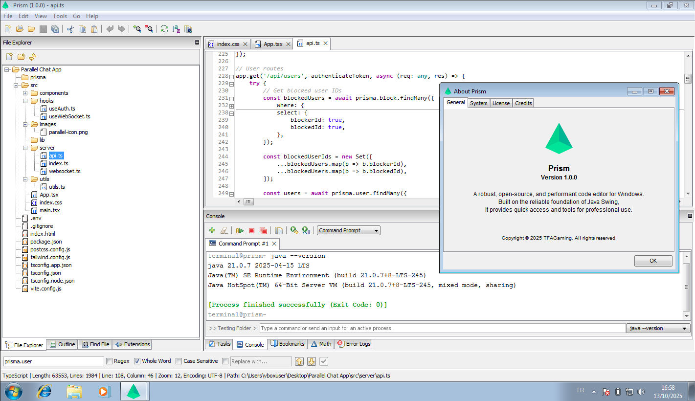

# [Prism](https://github.com/TFAGaming/Prism/) — Code Editor based on Java Swing

> **Status:** 🚧 *Under active development* 🚧  
> **Platform:** Windows 7 (x86-64) → Latest Windows release  

**Prism** is an **open-source**, **lightweight**, **super-fast**, and **highly customizable** code editor built entirely with **Java Swing**. Designed for performance and simplicity, Prism aims to deliver a smooth editing experience for developers who prefer a native desktop editor without the overhead of large frameworks.

[Click here](#installation) to install Prism.

### Note:

**Prism** is software designed for low-end computers, especially for users who still continue using outdated operating system versions, such as Windows 7. The application keeps its simplicity, without AI integration, and especially its performance.

If you currently have a device that has the ability to run other IDEs without any issues, then we recommend you not use Prism, unless you want to try it out!

## Features

Prism is packed with powerful features designed for speed and efficiency, helping you write, navigate, and run your code with ease.

### 💻 Core Editing Experience

* **Syntax Highlighting:** Beautiful and accurate coloring for popular programming languages.
* **Smooth Rendering:** Enjoy responsive, lag-free text rendering, even with large files (depending on your graphics card).
* **Advanced Text Features:** Includes essential features like **line numbers**, **multiple tabs & sessions**, and smart **auto-indentation**.
* **IntelliSense:** Powerful **Autocomplete** to speed up your coding.
* **Compiler Error Checker** (Upcoming!): Real-time feedback on code errors.

### 🧭 Navigation & Workflow

* **File Explorer:** A familiar **tree-style project view** with drag-and-drop support for easy file management (move, open, and view details).
* **Quick Jumps:** Add **bookmarks** to key lines and quickly **jump between definitions** or markers.
* **Code Outline:** Get a **real-time, structural view** of your code with clickable symbols for fast navigation.
* **File Switching:** Use the **quick file switcher** and **recent file list** to open files instantly.
* **Integrated Search:** Powerful, built-in **search and replace** functionality.

### 🛠️ Integrated Tools

* **Built-in Terminal:** Access a **system terminal** (Powershell/Command prompt) directly inside Prism to run scripts and commands easily.
* **Text Comparison (Difference):** Use the **side-by-side diff viewer** with highlighted line changes to compare files quickly.
* **Quick Commands** (Upcoming!): Execute scripts and commands directly via integrated tools.

### ⚙️ Performance & Customization

* **Built for Speed:** Optimized rendering and a **low memory footprint** ensure a snappy experience on both modern and older systems.
* **Extensible:** Customize your setup with the **plugin system** and easily configure settings via **JSON**.

## Requirements

- **Operating System**: Windows 7 or newer
- **Architecture**: x86-64 (64-bit)

## Installation

Go to [releases](https://github.com/TFAGaming/Prism/releases/), choose which version you want to download, click on **Assets**, and then click on the installer file (like `Prism_Setup_x64_build_07.10.2025.exe`) to download it. When the download finishes, double-click on it to install Prism.

The **Java Runtime Environment** (**JRE**), SE 21, is bundled within the application's installer. There is no need to worry if you have an outdated Java version or have never installed Java before.

Installation Screenshot

## Screenshots

#### Windows 7 Home Basic Service Pack 1 (64-bit)

## Development

Want to contribute? Prism is open for collaboration as development continues.

## License

Prism is released under the [Apache License 2.0](./LICENSE.txt)
