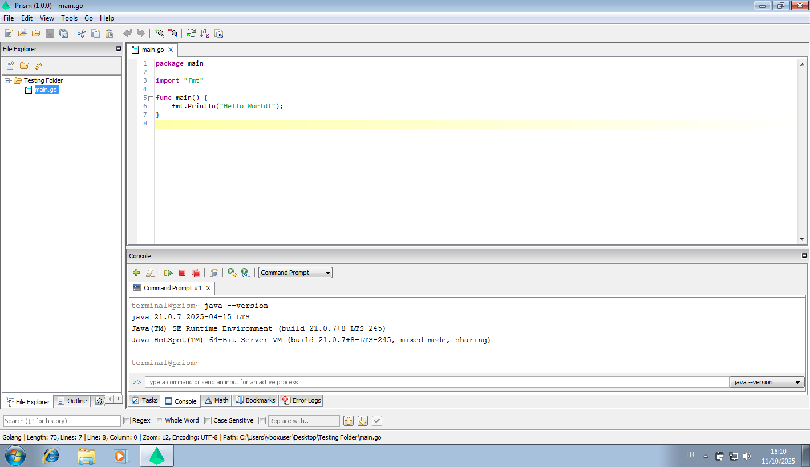

# Prism — Code Editor based on Java Swing

> **Status:** 🚧 *Under active development* 🚧  
> **Platform:** Windows 7 x86-64 → Latest Windows release  

**Prism** is an **open-source**, **lightweight**, **super-fast**, and **highly customizable** code editor built entirely with **Java Swing**. Designed for performance and simplicity, Prism aims to deliver a smooth editing experience for developers who prefer a native desktop editor without the overhead of large frameworks.

## Features

### 1. Core Editing
- Syntax highlighting for popular languages
- Smooth and responsive text rendering
- Multiple tabs & sessions
- Line numbers and auto-indentation
- Compiler error checker (upcoming)

### 2. Bookmarks & Navigation
- Add bookmarks to key lines for quick navigation
- Jump between definitions or markers
- Quick file switcher & recent file list (upcoming)

### 3. Code Outline
- Real-time structural view of your code
- Clickable symbols for fast navigation 

### 4. Tools & Shortcuts
- Quick run commands via tools (upcoming)
- Integrated search and replace

### 5. Built-in Terminal
- Access a system terminal directly within Prism (Powershell/Command prompt)
- Run scripts and commands without leaving the editor  

### 6. Text Comparison
- Side-by-side diff viewer  
- Highlighted line changes  

### 7. File Explorer
- Tree-style project view  
- Quick open, move files, and file details
- Drag-and-drop file support (upcoming)

### 8. Plugins & Customization
- Extensible plugin system (upcoming)  
- Custom themes, icons, and layouts  (upcoming)
- Configurable settings via JSON (upcoming)

### 9. Performance
- Built for speed with efficient Swing rendering  
- Low memory footprint  
- Optimized for both old and modern systems  

## Requirements

- **Operating System**: Windows 7 or newer
- **Architecture**: x86-64 (64-bit)

## Installation

Go to [releases](https://github.com/TFAGaming/Prism/releases/), choose which version you want to download, click on **Assets**, and then click on the installer file (like `Prism_Setup_x64_build_07.10.2025.exe`) to download it. When the download finishes, double-click on it to install Prism.

Installation Screenshot

## Screenshots

## Development

Want to contribute? Prism is open for collaboration as development continues.

## License

Prism is released under the [Apache License 2.0](./LICENSE.txt)
